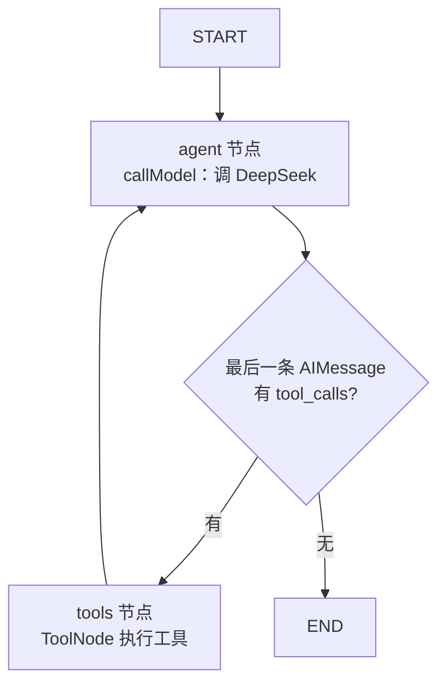
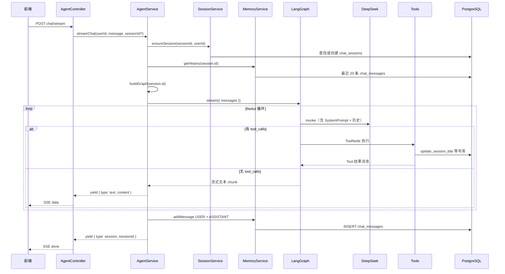

# Agent 核心流程

> 旅途 · AI 旅行规划助手  
> 代码入口：`travel-nest/src/agent/agent.service.ts`  
> 关联：`AgentController` · `MemoryService` · `SessionService` · `ToolsService` · LangGraph

---

## 1. 在系统中的位置

`AgentService` 是 AI 编排层：把 DeepSeek 大模型、9 个 Tool、会话记忆和 LangGraph 状态机串在一起，对外提供**流式**与**非流式**两种对话能力。

```
AgentController (HTTP/SSE)
        │
        ▼
  AgentService
   ├── SessionService   → chat_sessions（会话）
   ├── MemoryService    → chat_messages（消息，最近 20 条）
   ├── ToolsService     → 8 旅行 Tool + update_session_title
   └── LangGraph
         ├── DeepSeek LLM
         └── ToolNode（工具执行）
```

Controller 只负责 HTTP/SSE 协议；**怎么推理、调什么工具、怎么记历史**都在 `AgentService` 里完成。

---

## 2. LangGraph ReAct 循环

每次请求按 `sessionId` **动态编译**一张状态图（因为 `update_session_title` 需要绑定当前会话 ID，不能全局单例）。



| 节点 | 职责 |
|------|------|
| **agent** | 拼接 `SYSTEM_PROMPT + 历史 + 用户消息`，调用 `llm.bindTools(tools).invoke()` |
| **shouldContinue** | 若 AI 返回 `tool_calls` → 走 `tools`；否则 → `END` |
| **tools** | 执行天气/行程/预算等 Tool，结果追加到 `messages`，再回到 `agent` |

这就是 **ReAct**：Reason（推理）→ Act（调 Tool）→ 再 Reason，直到模型不再请求工具。

**递归上限**：`MAX_ITERATIONS × 2`（默认 6 × 2 = 12 步），防止 agent ↔ tools 死循环。

---

## 3. 一次流式对话的完整流程

入口：`POST /api/agent/chat/stream`  
Body：`{ userId, sessionId?, message }`



### 步骤说明

| 步骤 | 代码位置 | 说明 |
|------|----------|------|
| 1. 确保会话 | `sessionService.ensureSession()` | 有 `sessionId` 则复用，否则新建 `chat_sessions` |
| 2. 编译 Graph | `buildGraph(session.id)` | 绑定 9 个 Tool（含会话标题） |
| 3. 加载历史 | `memoryService.getHistory()` | DB → `HumanMessage` / `AIMessage` |
| 4. 拼消息 | `[...history, new HumanMessage(message)]` | 送入 Graph 初始状态 |
| 5. 流式执行 | `graph.stream({ streamMode: 'messages' })` | 只 yield `agent` 节点的文本 chunk |
| 6. 持久化 | `memoryService.addMessage()` | 流结束后写入 USER / ASSISTANT |
| 7. 回传 sessionId | `yield { type: 'session', sessionId }` | 前端可存 localStorage |

---

## 4. SYSTEM_PROMPT 的作用

定义于 `agent.service.ts` 顶部，每次 `callModel` 时作为 `SystemMessage` 拼在最前：

- **人设**：「旅途」AI 旅行规划师
- **工具清单**：9 个 Tool 及调用时机（含 `update_session_title`）
- **行为约束**：主动调工具、多工具串联、中文 + emoji、不暴露推理过程

模型是否选对工具、何时设会话标题，主要依赖这段 Prompt + Tool 的 `description`。

---

## 5. 为什么每次请求都 buildGraph？

参考 `backend` 在 `onModuleInit` 里**编译一次** Graph，工具是全局静态的。

`travel-nest` 中 `update_session_title` 必须通过工厂函数绑定 **当前 `sessionId`**：

```typescript
// tools/agent-tools.ts
buildAgentTools(sessionId, sessionService)
  → [...travelTools, createUpdateSessionTitleTool(sessionId, ...)]
```

因此 Graph 必须在每次 `streamChat` / `chat` 时按会话重新 `compile()`，代价很小，换来 Tool 上下文正确。

---

## 6. streamChat vs chat

| 方法 | 调用方式 | 用途 |
|------|----------|------|
| `streamChat()` | `graph.stream()` + AsyncGenerator | 生产主路径，SSE 逐字推送 |
| `chat()` | `graph.invoke()` 一次性 | 调试 / Postman，返回完整 JSON |

两者在会话管理、历史加载、持久化逻辑上一致，区别仅在输出方式。

---

## 7. 与 backend 参考代码的差异

| 维度 | backend（老师参考） | travel-nest |
|------|---------------------|-------------|
| 大模型 | Ollama | DeepSeek（OpenAI 兼容 API） |
| Graph 编译 | 启动时一次 | 每请求按 sessionId 动态编译 |
| 记忆 | 内存 `Map<userId, messages>` | PostgreSQL `chat_messages` |
| 会话 | 无 session 概念 | `sessionId` + `chat_sessions` |
| Tool 数量 | 8 个 | 9 个（+ `update_session_title`） |
| 历史 API | `GET /history/:userId` | `GET /history/:sessionId` |

---

## 8. 相关文件索引

| 文件 | 说明 |
|------|------|
| `travel-nest/src/agent/agent.service.ts` | LangGraph 编排、流式/同步对话 |
| `travel-nest/src/agent/agent.controller.ts` | REST + SSE 端点 |
| `travel-nest/src/memory/memory.service.ts` | 消息读写（Prisma） |
| `travel-nest/src/session/session.service.ts` | 会话创建、标题、列表 |
| `travel-nest/src/tools/agent-tools.ts` | 组装静态 + 动态 Tool |
| `travel-nest/src/tools/session-title.tool.ts` | 会话标题 Tool 工厂 |
| `travel-nest/src/llm/create-chat-model.ts` | DeepSeek ChatOpenAI 实例 |

---

## 9. 示例：用户首条消息

**输入**：「帮我规划河南 5 天亲子游」

1. 创建会话 `session-abc`，`title = null`
2. Graph 启动，模型可能依次调用：
   - `get_attractions`（河南景点）
   - `generate_itinerary`（5 天行程）
   - `update_session_title`（标题：「河南5天亲子游」）
3. 模型根据 Tool 结果生成最终回复，SSE 流式输出
4. 写入 2 条消息（USER + ASSISTANT）到 `chat_messages`
5. 返回 `sessionId` 给前端

---

*文档版本：v1.0 · 2026-05-26*
