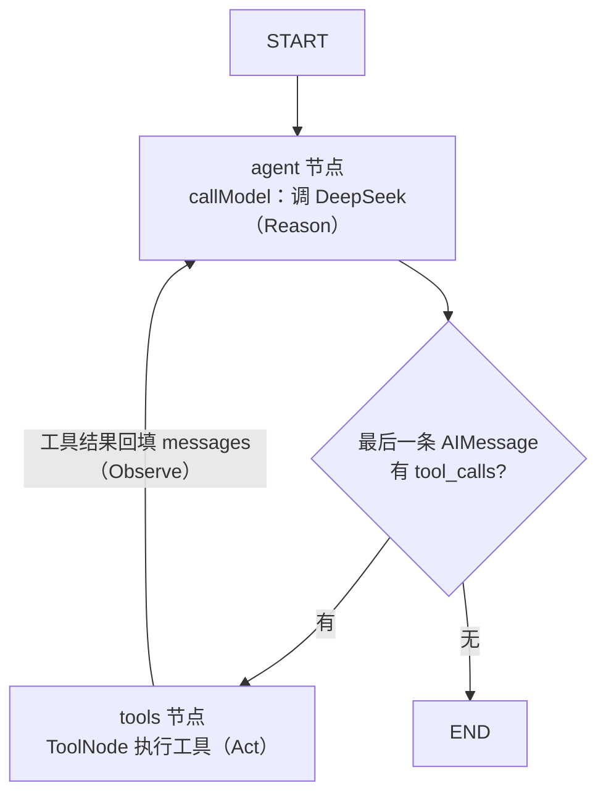

# ReAct 工作模式

> 旅途 · AI 旅行规划助手
> 代码入口：`apps/server/src/agent/agent.service.ts`
> 关联：`docs/Agent核心流程.md` · LangGraph · DeepSeek

---

## 1. 一句话理解

本项目里的 **react** 指的是 **ReAct（Reasoning + Acting）**——一种让大模型"边思考边调用工具"的 Agent 工作模式，**不是**前端的 React 框架。

> ReAct = **Reason（推理）→ Act（执行工具）→ Observe（观察结果）→ 再 Reason**，循环往复，直到模型认为不需要再调工具、可以直接回答为止。

它解决的核心问题是：大模型本身不知道实时天气、签证政策、汇率，也不能"动手"做事。ReAct 让模型在推理过程中**主动决定调用哪个工具**，把工具返回的结果当作新的"观察"再喂回去继续推理。

---

## 2. 在本项目里的落地

代码用 LangGraph 的 `StateGraph` 把 ReAct 循环画成了一张状态图：

```typescript
return new StateGraph(MessagesAnnotation)
  .addNode('agent', callModel)
  .addNode('tools', toolNode)
  .addEdge(START, 'agent')
  .addConditionalEdges('agent', shouldContinue, {
    tools: 'tools',
    [END]: END,
  })
  .addEdge('tools', 'agent')
  .compile();
```

对应到 ReAct 的三个角色：

| 角色 | 节点 | 职责 |
|------|------|------|
| **Reason** | `agent` 节点 | `callModel` 把 `SystemPrompt + 历史 + 当前消息` 喂给 DeepSeek，让它决定"要不要调工具、调哪个" |
| **判断** | `shouldContinue` | 看模型返回的最后一条 `AIMessage` 有没有 `tool_calls` |
| **Act** | `tools` 节点 | `ToolNode` 真正执行 `get_weather` 等工具 |

### 2.1 推理后判断要不要行动

```typescript
const shouldContinue = (state: typeof MessagesAnnotation.State) => {
  const last = state.messages[state.messages.length - 1] as AIMessage;
  return last.tool_calls?.length ? 'tools' : END;
};
```

- 模型输出里**有 `tool_calls`** → 去 `tools` 节点执行工具（Act）
- **没有** → 走 `END`，说明模型已经能直接回答了

### 2.2 工具执行完回到 agent 继续推理

```typescript
.addEdge('tools', 'agent')
```

工具结果会作为 `ToolMessage` 追加进 `messages`，再回到 `agent` 节点。模型"看到"了工具结果（Observe），于是进入下一轮推理。

---

## 3. 走一遍完整循环

以用户输入「帮我规划河南 5 天亲子游」为例：

```
START
  → agent：模型推理"先得知道有哪些景点" → 输出 tool_calls: get_attractions
  → tools：执行 get_attractions，返回河南景点列表
  → agent：模型看到景点 → 推理"现在排行程" → tool_calls: generate_itinerary
  → tools：执行，返回 5 天行程
  → agent：模型推理"该给会话起标题了" → tool_calls: update_session_title
  → tools：写库
  → agent：信息齐了，不再需要工具 → 直接输出最终回复（无 tool_calls）
  → END
```

`agent ↔ tools` 之间这种来回，就是 ReAct 循环。



---

## 4. 两个工程要点

### 4.1 防死循环

万一模型一直反复调工具，靠 `recursionLimit` 兜底：

```typescript
private getRecursionLimit() {
  const maxIterations = parseInt(
    this.config.get<string>('MAX_ITERATIONS', '6'),
    10,
  );
  return maxIterations * 2;
}
```

默认 `6 × 2 = 12` 步，超过就强制中断。乘 2 是因为一轮完整循环包含 `agent` + `tools` 两个节点。

### 4.2 System Prompt 引导推理

模型"何时调哪个工具"很大程度由 `SYSTEM_PROMPT` 和每个工具的 `description` 决定。例如提示词中的"复杂问题串联多个工具（查景点→生成行程→估算预算）"，就是在教模型怎么做 ReAct。

---

## 5. 小结

**ReAct 不是某个库的功能，而是一种"让模型在回答前可以多次调用工具、并根据工具结果继续思考"的编排范式。**

本项目中的：

```typescript
.addConditionalEdges('agent', shouldContinue)  // 推理后判断是否行动
.addEdge('tools', 'agent')                     // 行动后回到推理
```

这两条边，就是 ReAct 模式的本质实现。

更详细的图示与时序见 `docs/Agent核心流程.md` 第 2、3 节。

---

*文档版本：v1.0 · 2026-05-29*
