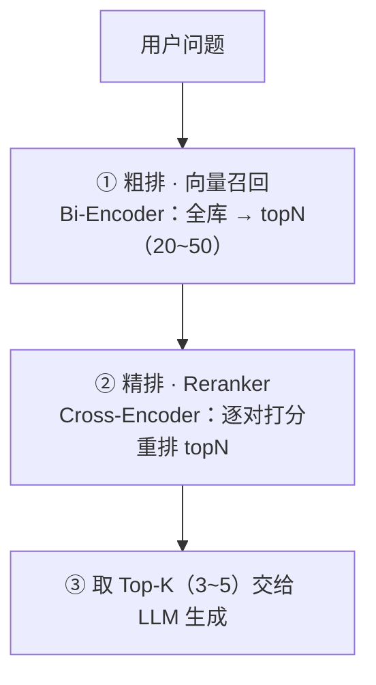

# Reranker 重排序介绍与接入说明

本文分两部分：先讲清 Reranker（重排序模型）是什么、为什么本项目需要它，再给出在现有 RAG 链路上的具体接入方案。

> **实施状态**：当前代码**尚未接入** Reranker，检索仍为「纯向量召回 + 距离阈值过滤」。本文的接入方案为设计稿，落地后请回来更新本节状态。

## 一、Reranker 是什么

### 1.1 两种编码器

检索里有两个容易混淆的概念：

| | Bi-Encoder（双塔） | Cross-Encoder（交叉编码） |
|---|---|---|
| 输入 | Query 与文档**分别**编码 | Query + 文档**拼接成一个序列** |
| 交互 | 无，两者编码时互不可见 | 有，模型内部逐词做完整注意力交互 |
| 输出 | 两个向量，比余弦距离 | 一个 0~1 的相关性分 |
| 速度 | 极快（向量可预计算、可建索引） | 慢（每对都要跑一次完整前向） |
| 精度 | 粗 | 精 |

**向量检索用的就是 Bi-Encoder**：文档入库时预先算好向量，查询时只算 Query 向量再做一次近邻查找，所以能在几万块数据上毫秒级返回。代价是 Query 和文档从未「见过面」，只能靠向量空间的远近粗略判断相关性。

**Reranker 就是 Cross-Encoder**：把「问题 + 候选文档」拼成一对一起喂进模型，让模型在词级别判断这篇文档是否真的回答了这个问题。它不能预计算、不能建索引，只能对**少量候选**逐对打分，因此天生是「精排」角色。

### 1.2 标准的两阶段检索



粗排负责**从全库快速捞出候选**（保证召回），精排负责**在候选里挑出真正相关的**（保证精度）。Reranker 只处理 topN，所以额外成本是一次 HTTP 往返（约 100~300ms），对问答场景可接受。

## 二、为什么本项目需要 Reranker

这不是「为了更先进」，而是当前参数调优已经触到天花板。

### 2.1 实测卡点

在 9 篇河南城市指南（29 个块）的评测中，出现了一组无法用阈值分开的样本：

| 问题 | 向量距离（余弦，越小越相关） | 期望行为 |
|---|---|---|
| 「安阳方特怎么玩」 | **0.5232** | 应该召回 |
| 「日本三年多次签证怎么办理」 | **0.5241** | 应该丢弃 |

两者**只差 0.0009**。相关文档比无关文档的距离还大，意味着无论 `RAG_MAX_DISTANCE` 调到多少，这两条必有一条判断错误：

- 阈值 ≥ 0.5241 → 无关的日本签证问题会通过过滤，被当资料喂给 LLM（幻觉风险）
- 阈值 ≤ 0.5232 → 真正相关的安阳方特内容被丢弃（漏召回）

### 2.2 参数网格实测

`16 题 × 全库排序` 的离线评估结果：

| topK \ 阈值 | 0.50 | 0.52 | 0.55 | 0.65（原始默认） |
|---|---|---|---|---|
| 3 | 10/14，漏 0 | **12/14，漏 0** | 13/14，漏 1 | 13/14，漏 1 |
| 5 | 10/14，漏 0 | **12/14，漏 0** | 14/14，漏 1 | 14/14，漏 1 |
| 8 | 10/14，漏 0 | **12/14，漏 0** | 14/14，漏 1 | 14/14，漏 1 |

当前采用 `RAG_MAX_DISTANCE=0.52` + `topK=5`（12/14）。要拿到剩下的 2 题，就必须在阈值之外引入第二道判据，也就是 Reranker。

结论：**这不是参数问题，是粗排的分辨率上限问题。**

## 三、模型选型

| 项 | 取值 |
|---|---|
| 模型 | `BAAI/bge-reranker-v2-m3` |
| 提供方 | 硅基流动（Silicon Flow） |
| 接口 | `POST {SILICON_FLOW_BASE_URL}/rerank`（OpenAI/Cohere 风格重排接口） |
| 密钥 | **复用现有的 `SILICON_FLOW_API_KEY`**，与 `bge-m3` 向量模型同一把 Key，无需新增账号 |

选它的原因：与当前向量模型同源（BGE 系列，中英双语、中文表现好），且不需要引入新的供应商和密钥。

## 四、接入方案

### 4.1 现状回顾

当前链路（`src/rag/rag.service.ts` 的 `query()`）：

1. `vectorStoreService.similaritySearchWithScore(question, topK)` — 召回 topK
2. `score <= RAG_MAX_DISTANCE` 过滤
3. 拼接 context → 套提示词调 LLM → 返回答案与来源

### 4.2 改造后的链路

1. `similaritySearchWithScore(question, RERANK_TOP_N)` — 先**多召回**（默认 20）
2. `rerankService.rerank(question, docs, RERANK_TOP_K)` — 逐对打分并重排
3. `relevanceScore >= RERANK_MIN_SCORE` 过滤 + 截断 topK
4. 后续拼接 context、调 LLM 不变

**关键点：改用 Reranker 后，`RAG_MAX_DISTANCE` 不再参与判定**（只保留作为 rerank 不可用时的降级阈值）。

### 4.3 新增环境变量

```bash
# ---------- RAG Reranker 重排序 ----------
# 是否启用重排序，默认 false（不填即走原有距离阈值逻辑）
RERANK_ENABLED=false
# 重排序模型
RERANK_MODEL=BAAI/bge-reranker-v2-m3
# 是否复用 SILICON_FLOW_API_KEY / SILICON_FLOW_BASE_URL（默认复用，无需单独填）
# RERANK_API_KEY=your-silicon-key
# RERANK_BASE_URL=https://api.siliconflow.cn/v1
# 粗排召回候选数（送入重排序的条数）
RERANK_TOP_N=20
# 精排后保留条数（不填则沿用接口传入的 topK）
# RERANK_TOP_K=5
# 重排序最低相关性分，低于则丢弃（0~1，越大越严格）
RERANK_MIN_SCORE=0.3
```

### 4.4 新增服务

新增 `apps/server/src/rag/rerank.service.ts`，在 `rag.module.ts` 中注册为 provider，由 `RagService` 注入：

```ts
/** 重排序结果：文档原文、原始索引与相关性分 */
export interface RerankItem {
  index: number;
  relevanceScore: number;
}

@Injectable()
export class RerankService {
  /** 是否启用（未启用时 RagService 走原有距离阈值逻辑） */
  readonly enabled: boolean;

  constructor(private readonly configService: ConfigService) {
    this.enabled =
      this.configService.get<string>('RERANK_ENABLED') === 'true' &&
      !!this.resolveApiKey();
  }

  /**
   * 对候选文档做交叉编码重排序。
   * 调用失败时抛出异常，由调用方降级为距离阈值过滤。
   */
  async rerank(
    query: string,
    documents: string[],
    topN: number,
  ): Promise<RerankItem[]> {
    const response = await fetch(`${this.resolveBaseUrl()}/rerank`, {
      method: 'POST',
      headers: {
        Authorization: `Bearer ${this.resolveApiKey()}`,
        'Content-Type': 'application/json',
      },
      body: JSON.stringify({
        model: this.configService.get('RERANK_MODEL') ?? 'BAAI/bge-reranker-v2-m3',
        query,
        documents,
        top_n: topN,
        return_documents: false,
      }),
      signal: AbortSignal.timeout(10000),
    });
    if (!response.ok) {
      throw new Error(`Rerank 请求失败：${response.status}`);
    }
    const data = (await response.json()) as {
      results: { index: number; relevance_score: number }[];
    };
    return data.results.map((item) => ({
      index: item.index,
      relevanceScore: item.relevance_score,
    }));
  }
}
```

要点：

- 用 Node 内置 `fetch`，不新增依赖
- `AbortSignal.timeout` 设置超时，避免重排序拖垮整个问答请求
- 接口 Key/BaseURL 缺省复用 `SILICON_FLOW_API_KEY` / `SILICON_FLOW_BASE_URL`

### 4.5 `RagService.query()` 改造

```ts
const rerankEnabled = this.rerankService.enabled;
// 启用重排序时多召回候选，否则沿用原 topK
const recallK = rerankEnabled
  ? parseInt(this.configService.get('RERANK_TOP_N') ?? '20', 10)
  : topK;

let retrieved = await this.vectorStoreService.similaritySearchWithScore(
  question,
  recallK,
);

let filtered: [Document, number][];

if (rerankEnabled) {
  try {
    const reranked = await this.rerankService.rerank(
      question,
      retrieved.map(([doc]) => doc.pageContent),
      topK,
    );
    const minScore = parseFloat(
      this.configService.get('RERANK_MIN_SCORE') ?? '0.3',
    );
    // 按重排序结果重建列表：拿分数 → 过滤 → 保序
    filtered = reranked
      .filter((item) => item.relevanceScore >= minScore)
      .slice(0, topK)
      .map((item) => {
        const [doc, distance] = retrieved[item.index];
        // 把重排序分写回元数据，便于 sources 返回给前端
        doc.metadata.rerankScore = item.relevanceScore;
        return [doc, distance] as [Document, number];
      });
  } catch {
    // 降级：重排序不可用时回退原有距离阈值过滤
    filtered = this.applyDistanceFilter(retrieved);
  }
} else {
  filtered = this.applyDistanceFilter(retrieved);
}
```

配套调整：

- 抽出 `private applyDistanceFilter(retrieved)`，封装现有 `RAG_MAX_DISTANCE` 逻辑，供降级分支复用
- `sources` 增加 `rerankScore` 字段（`metadata.rerankScore`），与原有 `similarity`（1 - 距离）并存，便于前端和排查时对比两种分数
- `searchVectorStore()`（`/api/rag/search`）**暂不改动**，保持纯向量检索语义，重排序仅在问答链路生效

### 4.6 不改动的部分

- `VectorStoreService` 接口不变——重排序是检索后的独立步骤，放在上层服务更合理，避免污染向量库抽象
- 入库链路（`loadDocuments`）完全不受影响，文档不需要重新入库
- 分块策略、提示词、Prisma 双写设计均不变

## 五、验证方案

### 5.1 用例集

沿用评测用的 16 题（含定向取数题、语义改写题、边界题、无关题），重点看两个边界样本：

| 问题 | 期望 |
|---|---|
| 「安阳方特怎么玩」 | 通过过滤，命中安阳指南 |
| 「日本三年多次签证怎么办理」 | 被过滤，返回「知识库中没有找到相关内容！」 |

### 5.2 指标

- **top-1 命中率**：重排序后第一条是否为期望文档
- **无关题拦截率**：无关问题是否全部被 `RERANK_MIN_SCORE` 拦下
- **对比基线**：当前 `0.52 + topK 5` 的成绩为 12/14，重排序目标应 ≥ 14/14
- **延迟**：重排序引入的额外耗时（预期 100~300ms）

### 5.3 验证方式

`/api/rag/search` 不走重排序，无法验证效果；应通过 `/api/rag/query` 或离线脚本（复用 `/tmp/rag/eval_retrieval.mjs` 的排序逻辑，把排序函数换成 rerank 分）验证。

> 注意：`/api/rag/query` 会调用 DeepSeek 生成答案，验证时需保证 DeepSeek 账户可用；仅验证排序可只比对返回的 `sources` 顺序。

## 六、成本与注意事项

- **只对 topN 重排**：全库跑 Cross-Encoder 不可行，`RERANK_TOP_N` 不宜过大（建议 10~30），越大越慢
- **超时必须设置**：重排序是外部 HTTP 依赖，务必有超时与降级，否则会拖垮整个问答
- **阈值语义变化**：启用重排序后 `RAG_MAX_DISTANCE` 退居降级路径，两套参数不要同时调，否则难以定位问题
- **分数不可跨模型比较**：`relevanceScore` 是重排序模型的输出，与向量距离不是同一量纲，`RERANK_MIN_SCORE` 需按实际分布实测确定（建议先用离线脚本跑一批样本看分布，再定值）
- **接口文档核对**：接入前请对照硅基流动官方文档确认 `/rerank` 的路径、请求字段与响应字段命名，若与本文示例不一致，以官方文档为准

## 七、参考

- 检索参数现状与实测数据：`apps/server/.env.example` 中 `RAG_MAX_DISTANCE` 注释、`apps/server/README.md`
- 向量库与分块表关系：`docs/知识库与向量表关系说明.md`
- 相关代码：`apps/server/src/rag/rag.service.ts`、`apps/server/src/rag/pgvector.service.ts`、`apps/server/src/rag/vector-store.interface.ts`