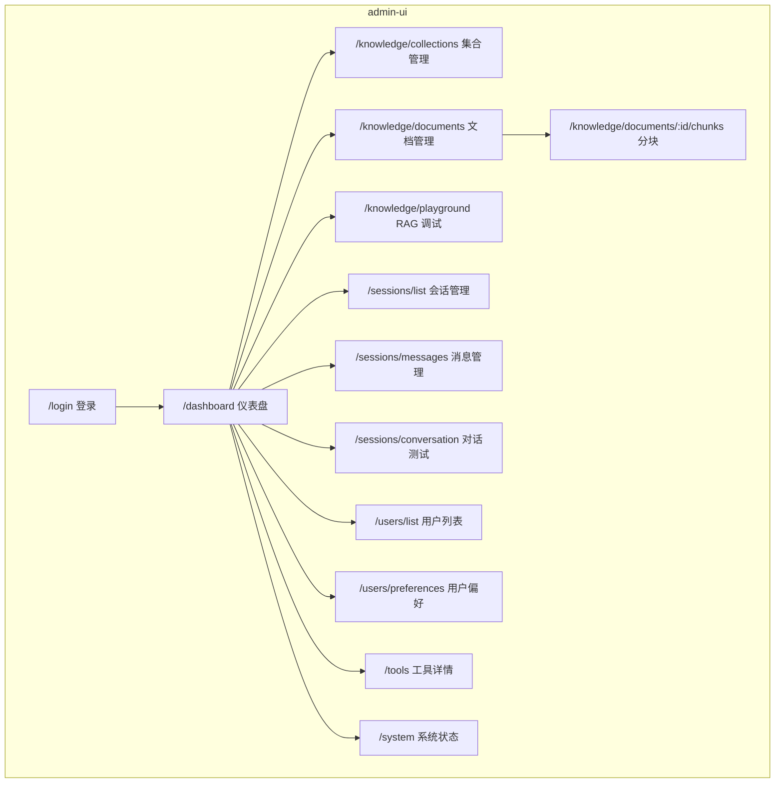
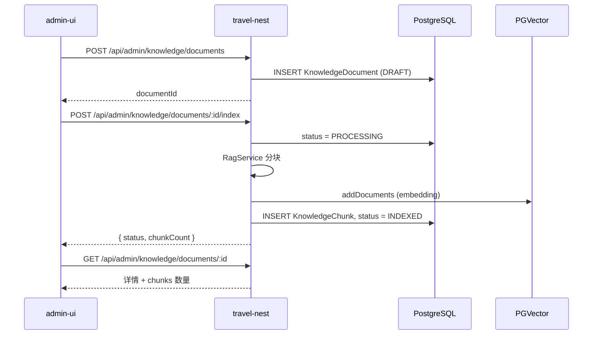
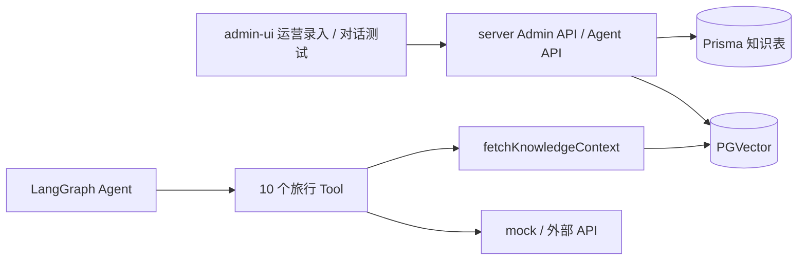

# admin-ui 管理后台设计

> 旅途 · AI 旅行规划助手 — B 端运营后台设计文档  
> 版本：v1.1 · 2026-05-27

---

## 1. 文档目的

定义 **admin-ui**（管理后台）的产品定位、信息架构、与 `server` 的 API 契约及分期实施计划，供前后端开发对齐。

**相关文档：**

- [Agent核心流程.md](./Agent核心流程.md) — Agent 对话与 LangGraph
- [用户画像与跨会话记忆设计.md](./用户画像与跨会话记忆设计.md) — 跨会话偏好
- [../apps/server/README.md](../apps/server/README.md) — 后端模块与 RAG 说明（待建）

---

## 2. 定位与边界

### 2.1 应用划分

| 应用 | 目录 | 用户 | 核心目标 |
|------|------|------|----------|
| **B 端** | **`apps/admin-ui/`** | 运营 / 管理员 | 知识入库、RAG 质检、数据观测、账号管理、对话测试 |
| 后端 | `apps/server/` | — | 统一 API、权限、持久化 |

> C 端（普通用户对话）暂未单独建前端项目，目前通过 admin-ui 的「对话测试」页面与 Agent 交互。

### 2.2 设计原则

1. **独立应用**：不与 C 端聊天页混用布局；采用侧栏 + 顶栏 + 内容区经典后台结构。
2. **权限隔离**：写操作仅 `User.role === ADMIN`；C 端 `USER` 不可访问 `/api/admin/*`。
3. **知识库优先**：第一优先级是 `KnowledgeCollection / Document / Chunk` 的运营，而非改 Tool 内 mock 代码。
4. **可验收**：提供 RAG 调试台，运营可自测「入库 → 检索 → 问答」全链路。

### 2.3 不在首期范围

- Tool 内 `DAILY_COSTS` 等 mock 的可视化编辑（三期可选）
- 面向 C 端的独立前端应用（当前通过 admin-ui「对话测试」页面替代）
- 多租户 / 多知识库租户隔离（后续扩展）

---

## 3. 技术选型

与 monorepo 对齐，降低维护成本：

```
travel-agent/
├── apps/
│   ├── admin-ui/      # B 端：Vue 3 + Vite + Element Plus + Pinia
│   └── server/        # NestJS 11 + Prisma + LangGraph + RAG
├── patches/           # pnpm 依赖补丁
└── docs/              # 技术文档
```

| 层级 | 选型 | 说明 |
|------|------|------|
| 框架 | Vue 3 + Vite | Composition API + `<script setup>` |
| UI | Element Plus | `el-menu`、`el-table`、`el-pagination`、`el-form`、`el-dialog` |
| 状态 | Pinia | 登录态（auth store） |
| 路由 | Vue Router | `createWebHashHistory`（hash 模式，兼容静态部署） |
| HTTP | axios | `baseURL: /api`，Vite 代理到 `http://localhost:3000` |
| Markdown | markdown-it + hljs + DOMPurify | 对话页渲染 AI 回复 |
| 端口 | `5174` | Vite 默认，被占用时自动递增 |

可选演进：Monorepo `packages/shared` 共享 TypeScript 类型（MVP 可不做）。

---

## 4. 信息架构

### 4.1 站点地图



### 4.2 布局结构

```
┌─────────────────────────────────────────────────────────┐
│ Logo  途旅AI              面包屑  [admin] [退出]          │
├──────────┬──────────────────────────────────────────────┤
│ 仪表盘    │  面包屑：会话观测 / 对话测试                   │
│ 知识库 ▼  │  ┌─────────────────────────────────────────┐ │
│  集合管理 │  │ 主内容（表格 / 表单 / 调试面板 / 对话页）  │ │
│  文档管理 │  └─────────────────────────────────────────┘ │
│  RAG 调试 │                                              │
│ 会话观测 ▼│                                              │
│  会话管理 │                                              │
│  消息管理 │                                              │
│  对话测试 │                                              │
│ 用户管理 ▼│                                              │
│  用户列表 │                                              │
│  用户偏好 │                                              │
│ 工具详情  │                                              │
│ 系统状态  │                                              │
└──────────┴──────────────────────────────────────────────┘
```

- 深色侧栏（`#304156`）+ 白色顶栏，与 C 端视觉区分。
- 复用 Element Plus：`el-menu`、`el-table`、`el-pagination`、`el-form`、`el-dialog`。
- 侧栏菜单 router 模式，`default-active` 根据当前路由自动高亮。

---

## 5. 页面设计

### 5.1 登录 `/login`

| 项 | 说明 |
|----|------|
| 表单 | 用户名/邮箱/手机号 + 密码 |
| 接口 | `POST /api/auth/login` |
| 校验 | 前端校验 `role === ADMIN`，非管理员提示「无管理权限」并拒绝进入 |
| Token | `accessToken` 存 `localStorage`；axios 拦截器自动注入 `Authorization: Bearer` |
| 跳转 | 成功 → `/dashboard` 仪表盘 |
| 路由守卫 | `router.beforeEach` 检查 `auth.isLoggedIn`，未登录重定向 `/login` |

### 5.2 仪表盘 `/dashboard`

**统计卡片（`GET /api/admin/stats`）：**

- 文档总数 / 已索引 / 处理中 / 入库失败
- 会话总数、消息总数
- 今日入库数

**快捷操作：**

- 新建文档 → 跳转 `/knowledge/documents/form`
- RAG 调试 → 跳转 `/knowledge/playground`
- 文档管理 → 跳转 `/knowledge/documents`

### 5.3 知识库 — 集合 `/knowledge/collections`

| 列 | 说明 |
|----|------|
| 名称 | 唯一，如 `travel-knowledge-base` |
| 描述 | 可选 |
| 文档数 | 聚合统计 |
| 更新时间 | |
| 操作 | 编辑描述、删除（二次确认，无文档时才可删） |

对应 Prisma：`KnowledgeCollection`。

### 5.4 知识库 — 文档 `/knowledge/documents`

**筛选条件：**

- 集合（collectionId）
- 分类（`KnowledgeCategory` 枚举）
- 状态（`DRAFT` / `PROCESSING` / `INDEXED` / `FAILED`）
- 标签（tags JSON 数组，前端 tag 输入）
- 标题关键词

**列表字段：**

| 列 | 说明 |
|----|------|
| 标题 | |
| 分类 | ATTRACTION_GUIDE、VISA 等 |
| 状态 | 带颜色标签 |
| 分块数 | chunkCount |
| 来源 | source |
| 更新时间 | |
| 操作 | 编辑、入库/重建索引、查看分块、删除 |

**新建/编辑表单：**

| 字段 | 类型 | 必填 |
|------|------|------|
| collectionId | 下拉 | ✅ |
| title | 文本 | |
| category | 枚举下拉 | ✅ |
| tags | 标签输入 | |
| source | 文本 | |
| content | 多行文本 / Markdown 编辑器 | ✅ |

**操作说明：**

- **保存草稿**：仅写 Prisma，`status = DRAFT`
- **入库 / 重建索引**：调用索引接口 → `PROCESSING` → 分块 + PGVector → `INDEXED` 或 `FAILED`
- **批量导入**（二期）：上传 `.md` / `.txt`，解析后批量创建并入库

对应 Prisma：`KnowledgeDocument`。

### 5.5 知识库 — 分块 `/knowledge/documents/:id/chunks`

只读排查页：

| 列 | 说明 |
|----|------|
| chunkIndex | 序号 |
| content | 文本摘要（可展开全文） |
| embeddingId | 关联 `langchain_pg_embedding` |
| metadata | JSON 预览 |

对应 Prisma：`KnowledgeChunk`。

### 5.6 知识库 — RAG 调试 `/knowledge/playground`

| 区域 | 功能 |
|------|------|
| 输入区 | 问题、topK（默认 3） |
| 检索 Tab | 调用 `POST /api/rag/search`，展示片段与 metadata |
| 问答 Tab | 调用 `POST /api/rag/query`，展示 answer + sources + similarity |

用于运营验收：入库后能否被检索、生成答案是否合理。

### 5.7 会话观测

二级菜单包含三个子页面：

**会话管理** `/sessions/list`

| 功能 | 接口 |
|------|------|
| 会话分页列表 | `GET /api/admin/sessions`（支持 userId/关键词筛选） |
| 会话详情（含消息） | `GET /api/admin/sessions/:id` |

**消息管理** `/sessions/messages`

| 功能 | 接口 |
|------|------|
| 消息分页列表 | `GET /api/admin/messages`（支持 sessionId/role 筛选） |

**对话测试** `/sessions/conversation`

| 功能 | 说明 |
|------|------|
| 左侧会话列表 | 仅展示当前 admin 自己的会话，支持搜索 + 新建对话 |
| 右侧消息区 | SSE 流式对话，消息平铺展示，含可折叠思维链面板 |
| 输入框 | 底部固定，Enter 发送，支持 shift+Enter 换行 |

用途：admin 自测 Agent 对话效果、Prompt 调试、知识库验收。

### 5.8 用户管理 `/users`

二级菜单包含两个子页面：

**用户列表** `/users/list`

| 列 | 操作 |
|----|------|
| 用户名、邮箱、角色、注册时间 | 改角色（`PATCH /api/admin/users/:id`） |

**用户偏好** `/users/preferences`

| 功能 | 接口 |
|------|------|
| 当前用户偏好 | `GET /api/admin/users/preferences` |

依赖 `User.role`（已有 `USER` / `ADMIN`）。

### 5.9 工具详情 `/tools`

| 功能 | 说明 |
|------|------|
| 工具列表 | `GET /api/agent/tools`，展示全部 10 个 Agent Tool 的名称、描述、参数 schema |
| 参数说明 | 每个工具的 zod schema 以表格形式展示 |

### 5.10 系统状态 `/system`

| 展示项 | 来源 |
|--------|------|
| 服务健康 | `GET /api/agent/health` |
| 模型名称 | health 响应 |
| 配置是否就绪 | 后端返回布尔项（不返回密钥明文）：`ZHIPU_API_KEY`、`DEEPSEEK_API_KEY`、`OPEN_WEATHER_API_KEY` 等 |
| 说明文案 | Tool mock 与知识库关系说明 |

---

## 6. 后端 API 设计（待实现）

### 6.1 模块结构

```
apps/server/src/admin/
├── admin.module.ts
├── guards/
│   ├── roles.guard.ts          # 校验 JWT 内 role
│   └── roles.decorator.ts      # @Roles(Role.ADMIN)
├── knowledge/
│   ├── knowledge.controller.ts
│   ├── knowledge.service.ts
│   └── dto/
├── session/
│   ├── session.controller.ts
│   └── session.service.ts
├── message/
│   ├── message.controller.ts
│   └── message.service.ts
├── users/
│   ├── users.controller.ts
│   └── users.service.ts
└── stats/
    ├── stats.controller.ts
    └── stats.service.ts
```

注册于 `AdminModule`；所有路由前缀 **`/api/admin`**。已实现全部 CRUD API。

### 6.2 权限模型

```typescript
@UseGuards(JwtAuthGuard, RolesGuard)
@Roles(Role.ADMIN)
@Controller('api/admin')
export class AdminKnowledgeController { ... }
```

**JWT Payload 需包含：** `sub`（userId）、`role`。

**登录：** 现有 `POST /api/auth/login` 返回体需包含 `role`；admin-ui 登录后校验。

**现有 RAG 接口：**

- `POST /api/rag/load` — MVP 可保留，建议改为仅 ADMIN 可调，或 admin 专用包装。
- `POST /api/rag/query`、`/search` — 调试台使用；生产可考虑仅 ADMIN。

### 6.3 API 清单

#### 统计

| 方法 | 路径 | 说明 |
|------|------|------|
| GET | `/api/admin/stats` | 仪表盘数字 |

#### 知识库 — 集合

| 方法 | 路径 | 说明 |
|------|------|------|
| GET | `/api/admin/knowledge/collections` | 列表（含文档数） |
| GET | `/api/admin/knowledge/collections/:id` | 详情 |
| POST | `/api/admin/knowledge/collections` | 创建 |
| PATCH | `/api/admin/knowledge/collections/:id` | 更新描述/metadata |
| DELETE | `/api/admin/knowledge/collections/:id` | 删除（无文档时） |

#### 知识库 — 文档

| 方法 | 路径 | 说明 |
|------|------|------|
| GET | `/api/admin/knowledge/documents` | 分页列表，支持筛选 query |
| GET | `/api/admin/knowledge/documents/:id` | 详情（含 chunks 摘要） |
| POST | `/api/admin/knowledge/documents` | 创建草稿 |
| PATCH | `/api/admin/knowledge/documents/:id` | 更新内容与元数据 |
| DELETE | `/api/admin/knowledge/documents/:id` | 删除文档及 chunks |
| POST | `/api/admin/knowledge/documents/:id/index` | 触发 RAG 入库（内部调 `RagService.loadDocuments`） |
| POST | `/api/admin/knowledge/documents/batch-import` | 批量创建并入库（二期） |

#### 知识库 — 分块

| 方法 | 路径 | 说明 |
|------|------|------|
| GET | `/api/admin/knowledge/documents/:id/chunks` | 分块列表 |

#### RAG（可复用现有，加守卫）

| 方法 | 路径 | 说明 |
|------|------|------|
| POST | `/api/rag/search` | 向量检索 |
| POST | `/api/rag/query` | RAG 问答 |

#### 会话 / 用户 / 消息

| 方法 | 路径 | 说明 |
|------|------|------|
| GET | `/api/admin/sessions` | 会话分页（支持 userId/keyword 筛选） |
| GET | `/api/admin/sessions/:id` | 会话详情（含消息列表） |
| GET | `/api/admin/messages` | 消息分页（支持 sessionId/role 筛选） |
| GET | `/api/admin/users` | 用户分页 |
| GET | `/api/admin/users/preferences` | 当前用户偏好 |
| PATCH | `/api/admin/users/:id` | 改角色等 |

### 6.4 分页与响应格式

与 C 端统一：走全局 `ResponseInterceptor` 封装。

**列表 query 建议：**

```
?page=1&pageSize=20&collectionId=&category=&status=&keyword=
```

**列表 data 建议：**

```json
{
  "items": [],
  "total": 100,
  "page": 1,
  "pageSize": 20
}
```

---

## 7. 核心业务流程

### 7.1 新建文档并入库



### 7.2 运营验收 RAG

1. 在「文档」创建《郑州中等预算参考》，分类 `DESTINATION`，tags `["河南","郑州"]`。
2. 点击「入库」，等待状态变为 `INDEXED`。
3. 打开「RAG 调试」，检索「郑州 5 天中等预算」。
4. 确认 `search` 命中片段；`query` 生成合理答案。
5. 打开「对话测试」页，以用户视角提问预算问题，确认 Tool 输出含知识库参考资料。

### 7.3 删除文档（二期需向量联动）

1. `DELETE` 文档 → 级联删除 `KnowledgeChunk`（Prisma `onDelete: Cascade`）。
2. 按 `embeddingId` 或 `docId` metadata 删除 PGVector 中向量（待 `RagService` 扩展）。

---

## 8. 与 C 端、Tool 的关系



| 数据来源 | 维护方式 | 消费者 |
|----------|----------|--------|
| 知识库文档 | **admin-ui 入库** | 全部 Tool（RAG 附录 + LLM 提示） |
| `DAILY_COSTS` 等 mock | 代码内写死 | budget 等 Tool 兜底 |
| OpenWeather | 环境变量 API Key | weather Tool |

**结论：** 「真数据」主路径是 **admin 维护知识库**，而非首期在 admin 编辑 mock 表。

---

## 9. 知识分类（与 Prisma 一致）

admin 文档表单的「分类」下拉与 `KnowledgeCategory` 对齐：

| 枚举值 | 含义 |
|--------|------|
| `GENERAL` | 未归类 / 综合 |
| `ATTRACTION_GUIDE` | 景点攻略 |
| `ATTRACTION_FACT` | 景点事实资料 |
| `VISA` | 签证与出入境 |
| `DESTINATION` | 目的地概览 |
| `TRANSPORT` | 交通 |
| `ACCOMMODATION` | 住宿 |
| `FOOD` | 美食 |
| `CUSTOMS` | 海关边防 |
| `SAFETY` | 安全应急 |
| `CULTURE` | 文化礼仪 |
| `POLICY` | 政策法规 |

**tags** 示例：`["河南", "少林寺", "2025"]` — 细粒度筛选，与分类互补。

---

## 10. 分期实施

### Phase 1 — MVP ✅ 已完成

| 端 | 交付物 | 状态 |
|----|--------|------|
| server | `AdminModule`、`RolesGuard`、知识库 CRUD、`documents/:id/index`、stats、会话/消息 API | ✅ |
| admin-ui | 脚手架、登录、仪表盘、文档列表/表单、入库、RAG 调试、会话观测、对话测试、工具详情、系统状态 | ✅ |

### Phase 2 — 效率与可维护

| 端 | 交付物 |
|----|--------|
| server | 批量导入、删除向量联动 |
| admin-ui | 批量上传 |

### Phase 3 — 运营与配置

| 端 | 交付物 |
|----|--------|
| server | 可选 DestinationDailyCost 表 |
| admin-ui | mock 配置（若需要） |

---

## 11. 目录与工程约定

### 11.1 admin-ui 目录

```
apps/admin-ui/
├── index.html
├── vite.config.ts          # port 5174, proxy /api → :3000
├── package.json
└── src/
    ├── main.js
    ├── App.vue
    ├── api/
    │   ├── http.js         # axios 实例 + 拦截器（自动解包 res.data）
    │   ├── auth.js
    │   ├── knowledge.js
    │   ├── rag.js
    │   ├── sessions.js
    │   ├── messages.js
    │   ├── tools.js
    │   └── admin-users.js
    ├── components/
    │   ├── LogoMark.vue
    │   └── MarkdownBody.vue # markdown-it + hljs + DOMPurify
    ├── layouts/
    │   └── AdminLayout.vue  # 侧栏 + 顶栏 + 面包屑
    ├── router/
    │   └── index.js         # hash 路由 + beforeEach 守卫
    ├── stores/
    │   └── auth.js          # Pinia 登录态
    ├── utils/
    │   └── renderMarkdown.js
    └── views/
        ├── login/
        │   └── LoginView.vue
        ├── dashboard/
        │   └── DashboardView.vue
        ├── knowledge/
        │   ├── CollectionList.vue
        │   ├── DocumentList.vue
        │   ├── DocumentForm.vue
        │   ├── ChunkList.vue
        │   └── Playground.vue
        ├── sessions/
        │   ├── SessionManage.vue
        │   ├── MessageList.vue
        │   └── ConversationView.vue
        ├── users/
        │   ├── UserList.vue
        │   └── UserPreferences.vue
        ├── tools/
        │   └── ToolDetail.vue
        └── system/
            └── SystemStatus.vue
```

### 11.2 环境变量（admin-ui）

通常仅开发代理，无独立后端密钥；密钥均在 `travel-nest/.env`。

---

## 12. 风险与约束

| 风险 | 缓解 |
|------|------|
| RAG 入库失败（`ZHIPU_API_KEY` 未配） | 文档状态 `FAILED` + 展示 `errorMessage`；系统状态页提示 |
| 删文档后向量残留 | 二期按 metadata 清理 PGVector |
| ADMIN 账号泄露 | 强密码、HTTPS、refresh token 轮换；生产禁用随意提权 |
| 大文档入库超时 | 前端 loading；后端异步任务（三期） |

---

## 13. 验收标准（MVP）

- [x] ADMIN 账号可登录 admin-ui，非 ADMIN 账号被拒绝
- [x] 可创建知识文档并入库，状态变为 `INDEXED`
- [x] RAG 调试台能检索到刚入库内容
- [x] 对话测试页可 SSE 流式对话，含思维链面板
- [x] 文档列表支持按分类、状态筛选
- [x] 仪表盘展示文档/会话/消息统计数据
- [x] 会话观测（会话管理 / 消息管理 / 对话测试）可正常使用
- [x] 工具详情页展示全部 10 个 Agent Tool 元数据

---

## 14. 修订记录

| 版本 | 日期 | 说明 |
|------|------|------|
| v1.1 | 2026-05-27 | 同步实际代码：`travel-nest`→`server`、菜单/路由更新、目录树、验收标准 |
| v1.0 | 2026-05-26 | 初稿：定位、IA、API、流程、分期 |
