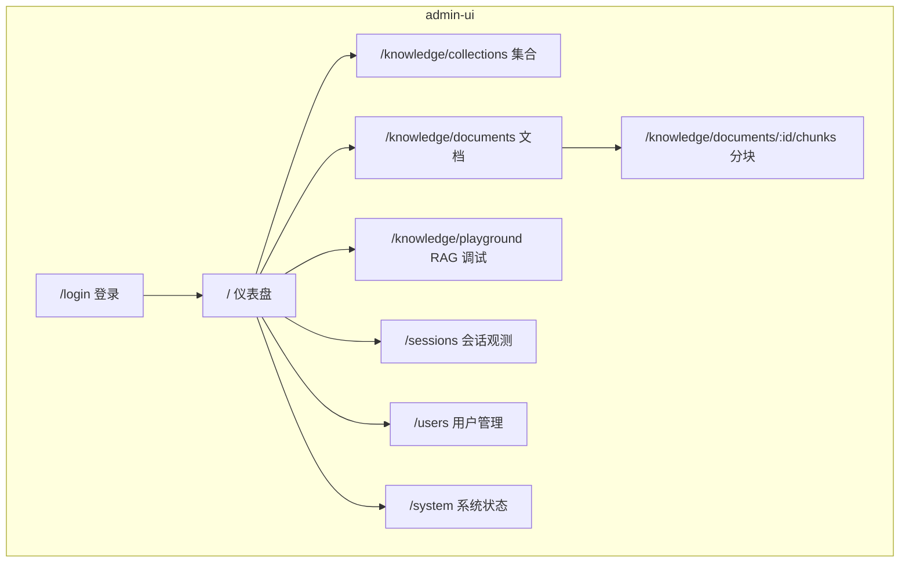
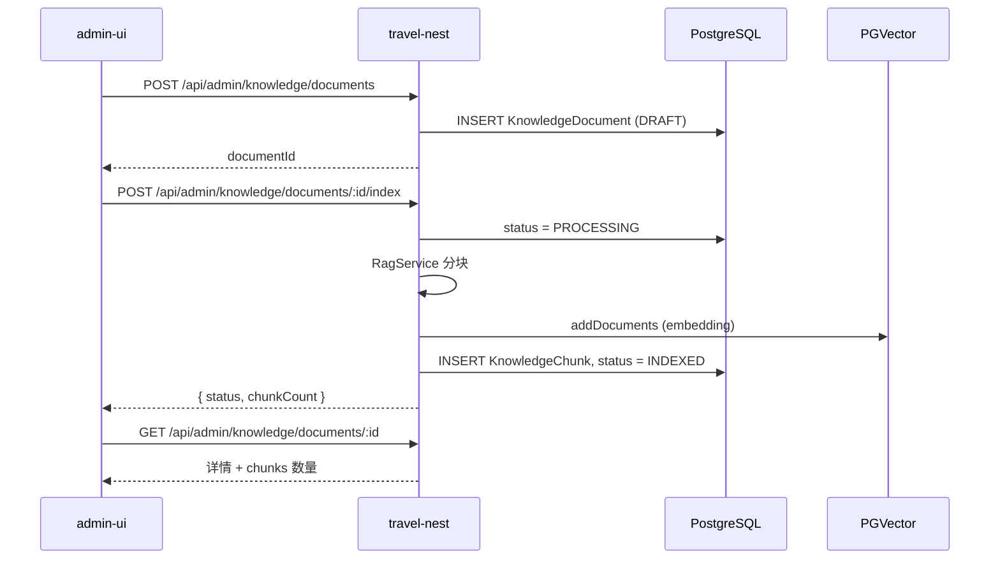
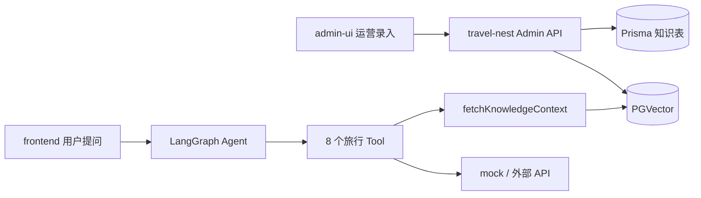

# admin-ui 管理后台设计

> 旅途 · AI 旅行规划助手 — B 端运营后台设计文档  
> 版本：v1.0 · 2026-05-26

---

## 1. 文档目的

定义 **admin-ui**（管理后台）的产品定位、信息架构、与 `travel-nest` 的 API 契约及分期实施计划，供前后端开发对齐。

**相关文档：**

- [Agent核心流程.md](./Agent核心流程.md) — C 端对话与 LangGraph
- [用户画像与跨会话记忆设计.md](./用户画像与跨会话记忆设计.md) — 跨会话偏好
- [travel-nest/README.md](../travel-nest/README.md) — 后端模块与 RAG 说明

---

## 2. 定位与边界

### 2.1 应用划分

| 应用 | 目录 | 用户 | 核心目标 |
|------|------|------|----------|
| C 端 | `frontend/` | 游客 / 注册用户 | 旅行对话、行程规划 |
| **B 端** | **`admin-ui/`**（待建） | 运营 / 管理员 | 知识入库、RAG 质检、数据观测、账号管理 |
| 后端 | `travel-nest/` | — | 统一 API、权限、持久化 |

### 2.2 设计原则

1. **独立应用**：不与 C 端聊天页混用布局；采用侧栏 + 顶栏 + 内容区经典后台结构。
2. **权限隔离**：写操作仅 `User.role === ADMIN`；C 端 `USER` 不可访问 `/api/admin/*`。
3. **知识库优先**：第一优先级是 `KnowledgeCollection / Document / Chunk` 的运营，而非改 Tool 内 mock 代码。
4. **可验收**：提供 RAG 调试台，运营可自测「入库 → 检索 → 问答」全链路。

### 2.3 不在首期范围

- Tool 内 `DAILY_COSTS` 等 mock 的可视化编辑（三期可选）
- 面向 C 端的营销页、SEO
- 多租户 / 多知识库租户隔离（后续扩展）

---

## 3. 技术选型

与现有 monorepo 对齐，降低维护成本：

```
travel-agent/
├── frontend/          # C 端：Vue 3 + Vite + Element Plus + Pinia
├── admin-ui/          # B 端：同上技术栈（新建）
└── travel-nest/       # NestJS 11 + Prisma + LangGraph + RAG
```

| 层级 | 选型 | 说明 |
|------|------|------|
| 框架 | Vue 3 + Vite | 与 `frontend/` 一致 |
| UI | Element Plus | 表格、表单、上传、消息提示 |
| 状态 | Pinia | 登录态、列表筛选条件 |
| 路由 | Vue Router | 建议 `history` 模式 |
| HTTP | axios | `baseURL: /api`，开发代理到 `http://localhost:3000` |
| 端口 | `5174` | 与 C 端 `5173` 错开 |

可选演进：Monorepo `packages/shared` 共享 TypeScript 类型（MVP 可不做）。

---

## 4. 信息架构

### 4.1 站点地图



### 4.2 布局结构

```
┌─────────────────────────────────────────────────────────┐
│ Logo  旅途管理后台              [管理员昵称] [退出]        │
├──────────┬──────────────────────────────────────────────┤
│ 仪表盘    │  面包屑：知识库 / 文档管理                     │
│ 知识库 ▼  │  ┌─────────────────────────────────────────┐ │
│  集合     │  │ 筛选区 + 操作按钮                         │ │
│  文档     │  ├─────────────────────────────────────────┤ │
│  RAG 调试 │  │ 主内容（表格 / 表单 / 调试面板）           │ │
│ 会话观测  │  └─────────────────────────────────────────┘ │
│ 用户管理  │                                              │
│ 系统状态  │                                              │
└──────────┴──────────────────────────────────────────────┘
```

- 视觉风格与 C 端区分（如深色侧栏），避免运营误用用户端。
- 复用 Element Plus：`el-menu`、`el-table`、`el-pagination`、`el-form`、`el-dialog`。

---

## 5. 页面设计

### 5.1 登录 `/login`

| 项 | 说明 |
|----|------|
| 表单 | 用户名/邮箱 + 密码 |
| 接口 | `POST /api/auth/login` |
| 校验 | 响应中 `role` 必须为 `ADMIN`，否则提示「无管理权限」并拒绝进入 |
| Token | `accessToken` 存 `localStorage`；axios 请求头 `Authorization: Bearer` |
| 跳转 | 成功 → `/` 仪表盘 |

### 5.2 仪表盘 `/`

**统计卡片（需后端 `GET /api/admin/stats`）：**

- 知识文档总数
- 已索引 / 处理中 / 失败 数量
- 今日新入库文档数
- 会话总数、消息总数（可选）

**快捷操作：**

- 新建文档
- 打开 RAG 调试

### 5.3 知识库 — 集合 `/knowledge/collections`

| 列 | 说明 |
|----|------|
| 名称 | 唯一，如 `travel-knowledge-base` |
| 描述 | 可选 |
| 文档数 | 聚合统计 |
| 更新时间 | |
| 操作 | 编辑描述、删除（二次确认，无文档时才可删） |

对应 Prisma：`KnowledgeCollection`。

### 5.4 知识库 — 文档 `/knowledge/documents`

**筛选条件：**

- 集合（collectionId）
- 分类（`KnowledgeCategory` 枚举）
- 状态（`DRAFT` / `PROCESSING` / `INDEXED` / `FAILED`）
- 标签（tags JSON 数组，前端 tag 输入）
- 标题关键词

**列表字段：**

| 列 | 说明 |
|----|------|
| 标题 | |
| 分类 | ATTRACTION_GUIDE、VISA 等 |
| 状态 | 带颜色标签 |
| 分块数 | chunkCount |
| 来源 | source |
| 更新时间 | |
| 操作 | 编辑、入库/重建索引、查看分块、删除 |

**新建/编辑表单：**

| 字段 | 类型 | 必填 |
|------|------|------|
| collectionId | 下拉 | ✅ |
| title | 文本 | |
| category | 枚举下拉 | ✅ |
| tags | 标签输入 | |
| source | 文本 | |
| content | 多行文本 / Markdown 编辑器 | ✅ |

**操作说明：**

- **保存草稿**：仅写 Prisma，`status = DRAFT`
- **入库 / 重建索引**：调用索引接口 → `PROCESSING` → 分块 + PGVector → `INDEXED` 或 `FAILED`
- **批量导入**（二期）：上传 `.md` / `.txt`，解析后批量创建并入库

对应 Prisma：`KnowledgeDocument`。

### 5.5 知识库 — 分块 `/knowledge/documents/:id/chunks`

只读排查页：

| 列 | 说明 |
|----|------|
| chunkIndex | 序号 |
| content | 文本摘要（可展开全文） |
| embeddingId | 关联 `langchain_pg_embedding` |
| metadata | JSON 预览 |

对应 Prisma：`KnowledgeChunk`。

### 5.6 知识库 — RAG 调试 `/knowledge/playground`

| 区域 | 功能 |
|------|------|
| 输入区 | 问题、topK（默认 3） |
| 检索 Tab | 调用 `POST /api/rag/search`，展示片段与 metadata |
| 问答 Tab | 调用 `POST /api/rag/query`，展示 answer + sources + similarity |

用于运营验收：入库后能否被检索、生成答案是否合理。

### 5.7 会话观测 `/sessions`（二期，只读）

| 功能 | 接口 |
|------|------|
| 会话列表 | `GET /api/admin/sessions`（分页，待建）或复用 agent 列表加守卫 |
| 消息详情 | `GET /api/agent/history/:sessionId` |

用途：客诉排查、Prompt 优化，**不提供**改消息、删用户聊天记录（或仅 SUPER_ADMIN 可选）。

### 5.8 用户管理 `/users`（二期）

| 列 | 操作 |
|----|------|
| 用户名、邮箱、角色、注册时间 | 改角色、禁用（待建 API） |

依赖 `User.role`（已有 `USER` / `ADMIN`）。

### 5.9 系统状态 `/system`

| 展示项 | 来源 |
|--------|------|
| 服务健康 | `GET /api/agent/health` |
| 模型名称 | health 响应 |
| 配置是否就绪 | 后端返回布尔项（不返回密钥明文）：`ZHIPU_API_KEY`、`DEEPSEEK_API_KEY`、`OPEN_WEATHER_API_KEY` 等 |
| 说明文案 | Tool mock 与知识库关系说明 |

---

## 6. 后端 API 设计（待实现）

### 6.1 模块结构

```
travel-nest/src/admin/
├── admin.module.ts
├── guards/
│   ├── roles.guard.ts          # 校验 JWT 内 role
│   └── roles.decorator.ts      # @Roles(Role.ADMIN)
├── knowledge/
│   ├── knowledge.controller.ts
│   ├── knowledge.service.ts
│   └── dto/
└── stats/
    ├── stats.controller.ts
    └── stats.service.ts
```

注册于 `AppModule`；所有路由前缀 **`/api/admin`**。

### 6.2 权限模型

```typescript
@UseGuards(JwtAuthGuard, RolesGuard)
@Roles(Role.ADMIN)
@Controller('api/admin')
export class AdminKnowledgeController { ... }
```

**JWT Payload 需包含：** `sub`（userId）、`role`。

**登录：** 现有 `POST /api/auth/login` 返回体需包含 `role`；admin-ui 登录后校验。

**现有 RAG 接口：**

- `POST /api/rag/load` — MVP 可保留，建议改为仅 ADMIN 可调，或 admin 专用包装。
- `POST /api/rag/query`、`/search` — 调试台使用；生产可考虑仅 ADMIN。

### 6.3 API 清单

#### 统计

| 方法 | 路径 | 说明 |
|------|------|------|
| GET | `/api/admin/stats` | 仪表盘数字 |

#### 知识库 — 集合

| 方法 | 路径 | 说明 |
|------|------|------|
| GET | `/api/admin/knowledge/collections` | 列表（含文档数） |
| GET | `/api/admin/knowledge/collections/:id` | 详情 |
| POST | `/api/admin/knowledge/collections` | 创建 |
| PATCH | `/api/admin/knowledge/collections/:id` | 更新描述/metadata |
| DELETE | `/api/admin/knowledge/collections/:id` | 删除（无文档时） |

#### 知识库 — 文档

| 方法 | 路径 | 说明 |
|------|------|------|
| GET | `/api/admin/knowledge/documents` | 分页列表，支持筛选 query |
| GET | `/api/admin/knowledge/documents/:id` | 详情（含 chunks 摘要） |
| POST | `/api/admin/knowledge/documents` | 创建草稿 |
| PATCH | `/api/admin/knowledge/documents/:id` | 更新内容与元数据 |
| DELETE | `/api/admin/knowledge/documents/:id` | 删除文档及 chunks |
| POST | `/api/admin/knowledge/documents/:id/index` | 触发 RAG 入库（内部调 `RagService.loadDocuments`） |
| POST | `/api/admin/knowledge/documents/batch-import` | 批量创建并入库（二期） |

#### 知识库 — 分块

| 方法 | 路径 | 说明 |
|------|------|------|
| GET | `/api/admin/knowledge/documents/:id/chunks` | 分块列表 |

#### RAG（可复用现有，加守卫）

| 方法 | 路径 | 说明 |
|------|------|------|
| POST | `/api/rag/search` | 向量检索 |
| POST | `/api/rag/query` | RAG 问答 |

#### 会话 / 用户（二期）

| 方法 | 路径 | 说明 |
|------|------|------|
| GET | `/api/admin/sessions` | 会话分页 |
| GET | `/api/admin/users` | 用户分页 |
| PATCH | `/api/admin/users/:id` | 改角色等 |

### 6.4 分页与响应格式

与 C 端统一：走全局 `ResponseInterceptor` 封装。

**列表 query 建议：**

```
?page=1&pageSize=20&collectionId=&category=&status=&keyword=
```

**列表 data 建议：**

```json
{
  "items": [],
  "total": 100,
  "page": 1,
  "pageSize": 20
}
```

---

## 7. 核心业务流程

### 7.1 新建文档并入库



### 7.2 运营验收 RAG

1. 在「文档」创建《郑州中等预算参考》，分类 `DESTINATION`，tags `["河南","郑州"]`。
2. 点击「入库」，等待状态变为 `INDEXED`。
3. 打开「RAG 调试」，检索「郑州 5 天中等预算」。
4. 确认 `search` 命中片段；`query` 生成合理答案。
5. 在 C 端 `frontend` 对话中问预算，确认 Tool 输出含「知识库参考资料」。

### 7.3 删除文档（二期需向量联动）

1. `DELETE` 文档 → 级联删除 `KnowledgeChunk`（Prisma `onDelete: Cascade`）。
2. 按 `embeddingId` 或 `docId` metadata 删除 PGVector 中向量（待 `RagService` 扩展）。

---

## 8. 与 C 端、Tool 的关系



| 数据来源 | 维护方式 | 消费者 |
|----------|----------|--------|
| 知识库文档 | **admin-ui 入库** | 全部 Tool（RAG 附录 + LLM 提示） |
| `DAILY_COSTS` 等 mock | 代码内写死 | budget 等 Tool 兜底 |
| OpenWeather | 环境变量 API Key | weather Tool |

**结论：** 「真数据」主路径是 **admin 维护知识库**，而非首期在 admin 编辑 mock 表。

---

## 9. 知识分类（与 Prisma 一致）

admin 文档表单的「分类」下拉与 `KnowledgeCategory` 对齐：

| 枚举值 | 含义 |
|--------|------|
| `GENERAL` | 未归类 / 综合 |
| `ATTRACTION_GUIDE` | 景点攻略 |
| `ATTRACTION_FACT` | 景点事实资料 |
| `VISA` | 签证与出入境 |
| `DESTINATION` | 目的地概览 |
| `TRANSPORT` | 交通 |
| `ACCOMMODATION` | 住宿 |
| `FOOD` | 美食 |
| `CUSTOMS` | 海关边防 |
| `SAFETY` | 安全应急 |
| `CULTURE` | 文化礼仪 |
| `POLICY` | 政策法规 |

**tags** 示例：`["河南", "少林寺", "2025"]` — 细粒度筛选，与分类互补。

---

## 10. 分期实施

### Phase 1 — MVP（可运营知识库）

| 端 | 交付物 |
|----|--------|
| travel-nest | `AdminModule`、`RolesGuard`、知识库 CRUD、`documents/:id/index`、stats |
| admin-ui | 脚手架、登录、文档列表/表单、入库按钮、RAG 调试页 |

### Phase 2 — 效率与可维护

| 端 | 交付物 |
|----|--------|
| travel-nest | 批量导入、删除向量联动、会话分页 API |
| admin-ui | 集合管理、分块预览、仪表盘、批量上传 |

### Phase 3 — 运营与配置

| 端 | 交付物 |
|----|--------|
| travel-nest | 用户管理 API、可选 DestinationDailyCost 表 |
| admin-ui | 用户管理、系统状态页、mock 配置（若需要） |

---

## 11. 目录与工程约定

### 11.1 admin-ui 目录（建议）

```
admin-ui/
├── index.html
├── vite.config.ts          # port 5174, proxy /api → :3000
├── package.json
└── src/
    ├── main.js
    ├── App.vue
    ├── api/
    │   ├── http.js         # axios 实例 + 拦截器
    │   ├── auth.js
    │   ├── knowledge.js
    │   └── rag.js
    ├── layouts/
    │   └── AdminLayout.vue
    ├── router/
    │   └── index.js
    ├── stores/
    │   └── auth.js
    └── views/
        ├── login/
        ├── dashboard/
        ├── knowledge/
        │   ├── CollectionList.vue
        │   ├── DocumentList.vue
        │   ├── DocumentForm.vue
        │   ├── ChunkList.vue
        │   └── Playground.vue
        ├── sessions/
        ├── users/
        └── system/
```

### 11.2 环境变量（admin-ui）

通常仅开发代理，无独立后端密钥；密钥均在 `travel-nest/.env`。

---

## 12. 风险与约束

| 风险 | 缓解 |
|------|------|
| RAG 入库失败（`ZHIPU_API_KEY` 未配） | 文档状态 `FAILED` + 展示 `errorMessage`；系统状态页提示 |
| 删文档后向量残留 | 二期按 metadata 清理 PGVector |
| ADMIN 账号泄露 | 强密码、HTTPS、refresh token 轮换；生产禁用随意提权 |
| 大文档入库超时 | 前端 loading；后端异步任务（三期） |

---

## 13. 验收标准（MVP）

- [ ] ADMIN 账号可登录 admin-ui，USER 账号被拒绝
- [ ] 可创建知识文档并入库，状态变为 `INDEXED`
- [ ] RAG 调试台能检索到刚入库内容
- [ ] C 端对话触发相关 Tool 时，回答含知识库附录
- [ ] 文档列表支持按分类、状态筛选

---

## 14. 修订记录

| 版本 | 日期 | 说明 |
|------|------|------|
| v1.0 | 2026-05-26 | 初稿：定位、IA、API、流程、分期 |
