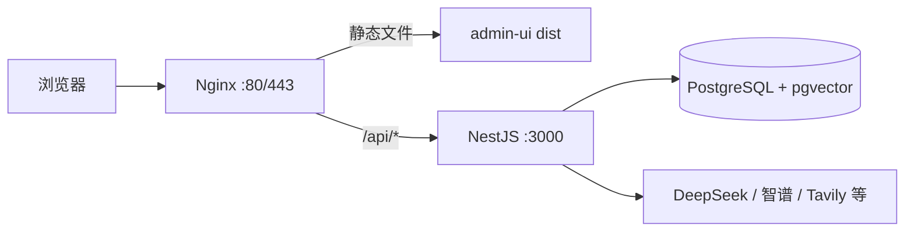

# Nginx 部署与运维

生产环境推荐架构：**Docker 跑 PostgreSQL**，**Node + PM2 跑后端**，**Nginx 托管前端静态文件并反代 API**。



下文以项目目录 `/opt/travel-agent`、服务器 IP `117.72.219.224` 为例，请按实际环境替换。

---

## 安装

```bash
apt update
apt install -y nginx
```

云主机安全组需放行 **80**（HTTP）和 **443**（HTTPS，可选）。数据库端口 **5432** 不要对公网开放。

---

## 站点配置

创建站点文件 `/etc/nginx/sites-available/travel-agent`：

```nginx
server {
    listen 80;
    server_name 117.72.219.224;   # 有域名后改成 yourdomain.com

    root /opt/travel-agent/apps/admin-ui/dist;
    index index.html;

    # Vue hash 路由：静态资源 + SPA 回退
    location / {
        try_files $uri $uri/ /index.html;
    }

    # API 反代（含 SSE 流式对话）
    location /api/ {
        proxy_pass http://127.0.0.1:3000;
        proxy_http_version 1.1;
        proxy_set_header Host $host;
        proxy_set_header X-Real-IP $remote_addr;
        proxy_set_header X-Forwarded-For $proxy_add_x_forwarded_for;
        proxy_set_header Connection '';

        proxy_buffering off;
        proxy_cache off;
        proxy_read_timeout 300s;
        chunked_transfer_encoding on;
    }
}
```

**说明**：

- 前端构建产物在 `apps/admin-ui/dist/`，请求基址为 `/api`（见 `apps/admin-ui/src/api/http.js`），生产环境由 Nginx 反代，无需改前端代码。
- `proxy_buffering off` 对流式对话（SSE）至关重要，否则页面可能一直转圈、无流式输出。
- 后端需已通过 PM2 在 `127.0.0.1:3000` 运行，且健康检查 `curl http://127.0.0.1:3000/api/agent/health` 正常。

### 启用站点

```bash
ln -sf /etc/nginx/sites-available/travel-agent /etc/nginx/sites-enabled/
rm -f /etc/nginx/sites-enabled/default
nginx -t
systemctl reload nginx
```

### 浏览器访问

| 页面 | 地址 |
|------|------|
| 管理后台登录 | `http://117.72.219.224/#/login` |
| API 健康检查 | `http://117.72.219.224/api/agent/health` |

---

## HTTPS（可选）

有域名且 DNS 已解析到服务器后：

```bash
apt install -y certbot python3-certbot-nginx
certbot --nginx -d yourdomain.com
```

---

## 常用运维命令

### 查看状态

```bash
systemctl status nginx
```

- `Active: active (running)` → 正在运行
- `Active: inactive (dead)` → 未启动

按 `q` 退出。

### 是否开机自启

```bash
systemctl is-enabled nginx
```

### 配置语法检查

```bash
nginx -t
```

显示 `syntax is ok` 和 `test is successful` 表示配置无误。**改配置后、重启前务必先执行此命令。**

### 是否监听 80 端口

```bash
ss -tlnp | grep :80
```

或：

```bash
netstat -tlnp | grep :80
```

### 启停与重载

| 操作 | 命令 | 说明 |
|------|------|------|
| 启动 | `systemctl start nginx` | |
| 停止 | `systemctl stop nginx` | |
| 重启 | `systemctl restart nginx` | 整进程重启 |
| 重载 | `systemctl reload nginx` | **改配置后优先使用**，不停机加载新配置 |

非 systemd 环境（如部分宝塔安装）：

```bash
service nginx restart
```

### 查看正在运行的网站

已启用的站点（软链接）：

```bash
ls -la /etc/nginx/sites-enabled/
```

查看各站点的 `server_name`、监听端口：

```bash
grep -r server_name /etc/nginx/sites-enabled/
```

汇总当前加载的配置：

```bash
nginx -T 2>/dev/null | grep -E 'server_name|listen |root '
```

查看单个站点完整配置：

```bash
cat /etc/nginx/sites-enabled/travel-agent
```

重点字段：

| 字段 | 含义 |
|------|------|
| `listen` | 监听端口（如 `80`） |
| `server_name` | 域名或 IP |
| `root` | 静态文件目录 |
| `location /api/` | 反代到后端的地址 |

### 日志

错误日志（页面打不开时）：

```bash
tail -50 /var/log/nginx/error.log
```

访问日志：

```bash
tail -20 /var/log/nginx/access.log
```

---

## 与应用更新联动

代码更新后，除重建后端/前端、重启 PM2 外，一般只需重载 Nginx（静态文件已替换时甚至可省略）：

```bash
cd /opt/travel-agent
git pull
pnpm install
pnpm run build:backend
pnpm run build:admin
pnpm run db:migrate
pm2 restart travel-api
systemctl reload nginx
```

---

## 常见问题

| 现象 | 排查 |
|------|------|
| 外网访问不了 80 | 检查云安全组是否放行 80/443，以及 `ufw` 规则 |
| 页面能开，登录或对话 502 | `pm2 status` 看后端是否在跑；`pm2 logs travel-api` 看是否缺 API Key 或数据库连不上 |
| 对话无流式输出 | 确认 Nginx 配置了 `proxy_buffering off` |
| `nginx -t` 失败 | 按报错行号修正站点配置后再 `reload` |
| 仍显示默认欢迎页 | 确认已 `rm` 掉 `sites-enabled/default`，且 `travel-agent` 软链接存在 |

---

## 相关文档

- 完整从零部署（含 Docker、PM2、环境变量）：见项目 README 与服务器部署对话记录
- 管理后台路由为 hash 模式，兼容纯静态托管：见 [admin-ui设计.md](./admin-ui设计.md)
