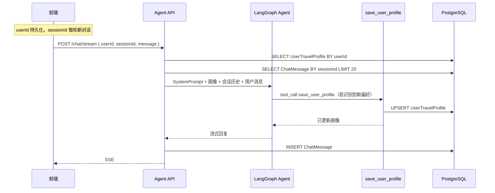

# 用户画像与跨会话记忆 — 设计文档

> 旅途 · AI 旅行规划助手  
> 状态：构思 / 待实现  
> 关联模块：`backend`（LangGraph Agent）、`travel-nest`（Prisma / 认证）、`frontend`（Pinia）

---

## 1. 背景与目标

### 1.1 现状

| 能力 | 当前实现 | 局限 |
|------|----------|------|
| 对话记忆 | `MemoryService` 内存 `Map<userId, BaseMessage[]>`，最多 20 条 | 服务重启丢失；无「会话」概念 |
| 用户标识 | 前端 `user_${Date.now()}`，未与登录用户打通 | 刷新页面可能换 id（若未持久化） |
| 用户偏好 | 无 | 新对话无法继承预算、饮食、出行风格等 |
| 工具集 | 8 个旅行工具（天气、行程、预算等） | 无「写入长期记忆」能力 |

### 1.2 目标

1. **跨会话记忆**：同一 `userId` 下，用户偏好与摘要在多次对话、多个 `sessionId` 之间保持。
2. **新会话注入**：创建新 `sessionId` 时，将已有画像注入 `SystemMessage`，无需模型从历史中猜测。
3. **智能体自主写入**：新增 Tool `save_user_profile`，由 Agent 在识别到稳定偏好后主动调用并存库。
4. **会话内上下文**：每个 `sessionId` 独立保存最近 N 条消息，供 LangGraph 多轮推理。

---

## 2. 核心概念

```
userId（长期不变）
  ├── UserTravelProfile     ← 跨会话用户画像（摘要 + 结构化偏好）
  └── ChatSession[]         ← 每次「新对话」一个 session
        └── ChatMessage[]   ← 本会话消息（短期上下文）
```

| 标识 | 生命周期 | 存储位置建议 | 用途 |
|------|----------|--------------|------|
| `userId` | 跨会话、跨设备（登录后） | localStorage / JWT `sub` | 关联画像与所有会话 |
| `sessionId` | 单次对话线程 | 每次「新对话」创建 | 加载本会话最近 N 条消息 |
| `profile` | 随 Tool 调用累积更新 | PostgreSQL | 注入新会话 System Prompt |

**原则**：画像跟 `userId` 走；消息跟 `sessionId` 走。

---

## 3. 数据模型（Prisma）

在 `travel-nest/prisma/schema.prisma` 中扩展（与 `User` 表解耦外键，以支持访客 `user_xxx`）：

```prisma
/// 用户旅行画像 — 跨会话偏好
model UserTravelProfile {
  userId      String   @id @map("user_id")
  summary     String?  @db.Text          // 自然语言摘要，注入 Prompt 的主文本
  preferences Json     @default("{}")    // 结构化偏好（可选）
  createdAt   DateTime @default(now()) @map("created_at")
  updatedAt   DateTime @updatedAt @map("updated_at")

  @@map("user_travel_profiles")
}

/// 聊天会话
model ChatSession {
  id        String        @id @default(uuid())
  userId    String        @map("user_id")
  title     String?
  messages  ChatMessage[]
  createdAt DateTime      @default(now()) @map("created_at")
  updatedAt DateTime      @updatedAt @map("updated_at")

  @@index([userId])
  @@map("chat_sessions")
}

/// 聊天消息
model ChatMessage {
  id        String      @id @default(uuid())
  sessionId String      @map("session_id")
  role      MessageRole
  content   String      @db.Text
  createdAt DateTime    @default(now()) @map("created_at")
  session   ChatSession @relation(fields: [sessionId], references: [id], onDelete: Cascade)

  @@index([sessionId, createdAt])
  @@map("chat_messages")
}

enum MessageRole {
  USER
  ASSISTANT
}
```

### 3.1 `preferences` JSON 建议字段

```json
{
  "budgetLevel": "中等",
  "travelStyle": ["慢游", "亲子"],
  "dietaryRestrictions": ["素食"],
  "companions": "带两名儿童",
  "preferredDestinations": ["日本", "东南亚"],
  "dislikes": ["红眼航班", "高强度打卡"]
}
```

`summary` 面向模型阅读；`preferences` 面向展示、筛选与后续结构化逻辑。

---

## 4. 总体架构



### 4.1 读写分工

| 操作 | 执行方 | 说明 |
|------|--------|------|
| **读画像、注入 Prompt** | 服务端 `AgentService` | 每条消息前查库，保证新 `sessionId` 首条即带画像 |
| **写画像** | Tool `save_user_profile` | 模型自主决定何时写入 |
| **读会话历史** | `MemoryService`（Prisma） | 按 `sessionId` 取最近 20 条 |
| **写会话消息** | `MemoryService` | 流式结束后写入 USER / ASSISTANT |

---

## 5. 用户画像 Tool 设计

### 5.1 设计思路

不采用「每轮对话结束后后台再调一次 LLM 全量抽取」作为主路径，而是：

- 由 **当前智能体** 在对话中提炼可长期复用的偏好描述；
- 通过 **`save_user_profile` Tool** 自主规划调用；
- Tool 仅负责 **持久化**，不做二次推理。

与现有 8 个旅行工具同属 LangChain `tool()` + Zod + LangGraph `ToolNode` 体系。

### 5.2 工具定义（概念）

```typescript
save_user_profile({
  profileText: string,              // 必填：本轮提炼的画像描述（中文短句/要点）
  mergeMode?: 'append' | 'replace',   // 默认 append
  tags?: string[],                    // 可选：写入 preferences 的标签
})
```

**`description` 示例（写入 Tool 元数据）：**

```text
当用户明确或隐含表达以下「长期稳定」信息时调用：
预算档次、同行人、饮食禁忌、旅行节奏、偏好/厌恶的目的地或出行方式。
不要为单次行程细节调用（如「明天去少林寺」）。
同一轮若已保存相同信息，勿重复调用。
```

### 5.3 读取画像：是否需要 `get_user_profile` Tool？

#### 5.3.1 结论（决策）

| 阶段 | 读取方式 | 是否提供 `get_user_profile` Tool |
|------|----------|----------------------------------|
| **一期（推荐）** | 服务端每条消息前查库，注入 `SystemMessage` | **不做** |
| **二期（按需）** | 同上为主；特殊场景由模型主动 `get` | **可选增加** |

**跨会话记忆不依赖「读取 Tool」**；读取 Tool 不能替代服务端注入，否则小模型漏调会导致新会话「失忆」。

#### 5.3.2 三种读取路径对比

| 路径 | 执行时机 | 是否 Tool | 可靠性 | 适用场景 |
|------|----------|-----------|--------|----------|
| **A. 服务端注入** | `streamChat` / `callModel` 前，`ProfileService.getContextBlock(userId)` | 否 | 最高 | 新会话首条、每条消息的默认读法 |
| **B. `get_user_profile` Tool** | 模型在 ReAct 循环中自主 `tool_call` | 是 | 中（依赖模型是否调用） | 中途核对、用户追问「你记得什么」 |
| **C. REST API** | 前端设置页 / 调试 `GET /profile/:userId` | 否 | 高 | 给人看，不给模型用 |

**推荐组合**：A（必须）+ C（可选）+ B（二期可选）。

```
用户发消息
  │
  ├─► [A] 服务端查库 → 拼入 SystemPrompt（每请求必做）
  │
  └─► LangGraph Agent
        ├─► 推理 / 调旅行工具
        ├─► [B 可选] get_user_profile()  ← 仅在不确认库内容时
        └─► save_user_profile(...)       ← 发现新偏好时写入
```

#### 5.3.3 什么时候值得做 `get_user_profile`？

**建议做（二期）的情况：**

- 画像 `summary` 很长，希望**按需拉取**以压缩每轮 Prompt（需接受漏调风险，或配合 A 注入摘要缩写版）。
- 多轮对话中模型需对比「库中已有 vs 用户刚说」，再决定 `append` 还是 `replace`。
- 用户明确问：「你记得我什么偏好？」——显式查库后回答更贴切。
- 演示 / 调试 tool_calls 链路。

**可以不做的情况：**

- 画像控制在数百字内，**服务端全量注入**即可。
- 主要使用 Ollama 小模型：工具越多，越易选错、漏调、多一轮延迟。
- 团队希望一期尽快上线：仅 `save` + 注入即可闭环。

#### 5.3.4 若实现 `get_user_profile` 的规范

```typescript
get_user_profile()  // 无参；userId 由服务端工厂绑定，禁止模型传入
```

**返回示例（Tool 结果字符串）：**

```text
【当前用户旅行画像】
摘要：预算偏中等；偏好慢游、亲子出行；饮食忌辛辣。
结构化偏好：{"budgetLevel":"中等","travelStyle":["慢游","亲子"],...}
若无记录：当前尚无保存的长期偏好。
```

**`description` 示例：**

```text
查询该用户已保存的长期旅行画像。
优先使用系统提示中已提供的【用户长期偏好】；仅在以下情况调用：
1) 用户询问「你记得我什么」；
2) 保存前需确认是否与已有画像重复；
3) 系统提示中未包含画像块（异常场景）。
不要每轮都调用。
```

与 `save_user_profile` 共用工厂：`createProfileTools(userId, prisma)` 返回 `[save, get]`。

#### 5.3.5 System Prompt 与读取 Tool 的写法（若二期启用 get）

```text
【用户长期偏好】已在下方提供（由系统注入）。规划行程时优先使用，无需为此调用 get_user_profile。

可用工具：
- save_user_profile：写入新的长期偏好。
- get_user_profile：（可选）仅在用户询问记忆内容，或保存前需核对是否重复时调用。
```

#### 5.3.6 风险：只有读 Tool、没有服务端注入

| 问题 | 后果 |
|------|------|
| 模型未调用 `get` | 新 session 第一条回复不体现历史偏好 |
| 每轮都调用 `get` | 多一轮延迟与 token 消耗 |
| 与 `save` 顺序错乱 | 基于过期上下文覆盖写入 |

**因此：读 Tool 永远是 A 的补充，不能取代 A。**

---

### 5.4 关键实现约束：`userId` 不得由模型填写

现有工具（如 `get_weather`）无用户上下文。画像 Tool 必须通过 **工厂函数** 绑定 `userId`：

```typescript
// backend/src/tools/user-profile.tool.ts
export function createSaveUserProfileTool(userId: string, prisma: PrismaService) {
  return tool(
    async ({ profileText, mergeMode = 'append', tags }) => {
      // upsert UserTravelProfile where userId
      return '已更新用户旅行画像，后续对话将据此个性化推荐。'
    },
    {
      name: 'save_user_profile',
      description: '...',
      schema: z.object({ ... }),
    },
  )
}
```

`streamChat(userId, sessionId, message)` 每次请求时：

1. 用该 `userId` 生成当次专用的 `save_user_profile`；
2. 与 8 个旅行工具一并 `bindTools`；
3. 若 Graph 为全局单例，需 **按请求动态 compile**，或使用 **AsyncLocalStorage** 在 Tool 内读取 `userId`。

### 5.5 合并策略

| `mergeMode` | 行为 |
|-------------|------|
| `append`（默认） | `summary` 追加新 `profileText`，简单去重相同句子 |
| `replace` | 整段覆盖 `summary`（用户明确更正时） |
| `tags` | 合并进 `preferences` 对应数组字段，去重 |

Tool 返回固定文案，便于模型下一轮引用，例如：`已更新用户画像，当前共 N 条要点`。

---

## 6. Agent 层改动要点

### 6.1 System Prompt 补充

在现有 `SYSTEM_PROMPT`（`backend/src/agent/agent.service.ts`）中增加：

```text
可用工具：
- save_user_profile：将用户长期旅行偏好写入记忆（跨会话生效）。
  识别到新的稳定偏好后调用；保存成功后可用一句话告知用户「已记住」。

工作原则（补充）：
- 规划行程前先结合【用户长期偏好】个性化回答（若已提供）。
```

### 6.2 画像注入（读路径）

在 `callModel` 或 `streamChat` 入口：

```typescript
const profileBlock = await profileService.getContextBlock(userId)
// 例：\n\n【用户长期偏好】\n摘要：...\n结构化偏好：...
const system = new SystemMessage(SYSTEM_PROMPT + profileBlock)
```

**新 `sessionId` 的第一条消息也必须带画像**，不依赖模型主动调用 `get_user_profile`。

### 6.3 会话消息（短期记忆）

- `getHistory(sessionId)` → 最近 20 条 `ChatMessage` 转为 `HumanMessage` / `AIMessage`；
- 流式结束后 `addMessage(sessionId, userId, role, content)`；
- `ensureSession(sessionId?, userId)`：无 `sessionId` 时自动创建。

### 6.4 与全局 Graph 的关系

当前 `onModuleInit` 中一次性 `compile()` Graph。引入按 `userId` 绑定的 Tool 后，可选方案：

| 方案 | 说明 |
|------|------|
| A. 每请求 compile | 实现简单，略有开销 |
| B. AsyncLocalStorage | Graph 单例，Tool 内读当前请求的 `userId` |
| C. 自定义 ToolNode | 在节点内注入 context |

推荐 **B** 或 **A**，按团队熟悉度选择。

---

## 7. API 设计

### 7.1 变更与新增

| 方法 | 路径 | Body / 参数 | 说明 |
|------|------|-------------|------|
| `POST` | `/api/agent/chat/stream` | `{ userId, sessionId?, message }` | 流式对话；可返回 `sessionId` |
| `POST` | `/api/agent/sessions` | `{ userId, title? }` | 创建新会话，返回 `sessionId` |
| `GET` | `/api/agent/sessions` | `?userId=` | 用户的会话列表 |
| `GET` | `/api/agent/history/:sessionId` | — | 某会话消息（替代按 userId） |
| `DELETE` | `/api/agent/history/:sessionId` | — | 清空会话消息，**不删画像** |
| `GET` | `/api/agent/profile/:userId` | — | 查看画像（调试 / 设置页） |
| `PATCH` | `/api/agent/profile/:userId` | `{ summary?, preferences? }` | 用户手动修正画像 |

### 7.2 SSE 扩展（可选）

```json
{ "type": "session", "sessionId": "uuid" }
{ "type": "text", "content": "..." }
{ "type": "done" }
```

首包或 `done` 时带回 `sessionId`，前端写入 localStorage。

---

## 8. 前端约定

### 8.1 本地持久化

```javascript
const USER_ID_KEY = 'travel_user_id'       // 跨会话不变
const SESSION_ID_KEY = 'travel_session_id' // 每次新对话更新
```

| 操作 | `userId` | `sessionId` |
|------|----------|-------------|
| 首次访问 | 生成并持久化 | 空或首次聊天时由后端创建 |
| 继续当前对话 | 不变 | 不变 |
| 点击「清空 / 新对话」 | 不变 | 调用 `POST /sessions` 换新 |
| 登录成功 | 改为 JWT `sub` | 新建会话 |

### 8.2 与 travel-nest 认证对接

- 访客：`user_${timestamp}` 存 localStorage，画像仍可按该 id 积累；
- 登录后：`userId = authUser.id`；
- 可选：登录时将访客画像 merge 到正式用户（二期）。

---

## 9. 方案对比与推荐组合

### 9.1 画像更新策略

| 方案 | 优点 | 缺点 |
|------|------|------|
| **仅 Tool（主路径）** | 可解释、按需写入、与 ReAct 一致 | 小模型可能漏调、误调 |
| **仅对话后 LLM 抽取** | 更新稳定 | 额外成本、与 Agent 推理重复 |
| **Tool + 服务端注入 + 兜底抽取** | 生产最稳 | 实现稍复杂 |

**推荐组合：**

1. **主路径**：`save_user_profile` Tool，Prompt 明确调用时机；
2. **读路径**：每条消息前服务端查库注入 `summary`；
3. **兜底（可选）**：会话结束若本轮有实质对话且未调用过 save，再跑一次轻量抽取。

### 9.2 Tool 自主调用的风险与缓解

| 风险 | 缓解 |
|------|------|
| 漏调 | 服务端注入已有画像；Prompt 强调「识别到偏好应调用」 |
| 误调（一次性需求当长期偏好） | Tool description 列举「不应调用」的反例 |
| 重复调 | Tool 内去重；同轮相同 `profileText` 跳过 |
| 小模型 tool 能力弱 | 兜底抽取；或使用 DeepSeek 等较强模型 |

---

## 10. 实现清单（待办）

### 10.1 数据层（travel-nest）

- [ ] 扩展 `schema.prisma`：`UserTravelProfile`、`ChatSession`、`ChatMessage`
- [ ] `npx prisma migrate dev`
- [ ] `npx prisma generate`

### 10.2 后端 Agent（backend）

- [ ] 接入 Prisma（共享 `travel-nest/generated/prisma`，`DATABASE_URL` 写入 `backend/.env`）
- [ ] `PrismaService` + 改造 `MemoryService`（按 `sessionId` 持久化）
- [ ] `ProfileService`（`getContextBlock`、合并逻辑）
- [ ] `createSaveUserProfileTool(userId)` + 注册到 `agent.service.ts`
- [ ] （二期）`createGetUserProfileTool(userId)`，Prompt 约定调用时机
- [ ] 更新 `SYSTEM_PROMPT`、`callModel` 画像注入
- [ ] `agent.controller.ts` 新 API、`getTools()` 列表

### 10.3 前端

- [ ] `userId` / `sessionId` localStorage
- [ ] `streamChat` 传 `sessionId`；「新对话」调 `createSession`
- [ ] 登录后切换 `userId`

### 10.4 文档与测试

- [ ] 更新 `CLAUDE.md` 工具注册说明
- [ ] 样例：用户说「预算有限、带小孩」→ 应触发 `save_user_profile` → 新会话回复体现偏好

---

## 11. 目录与文件规划

```
travel-agent/
├── docs/
│   └── 用户画像与跨会话记忆设计.md    ← 本文档
├── travel-nest/
│   └── prisma/schema.prisma          ← 数据模型
├── backend/
│   └── src/
│       ├── prisma/prisma.service.ts
│       ├── profile/profile.service.ts
│       ├── memory/memory.service.ts   ← 改造为 DB
│       ├── tools/user-profile.tool.ts ← 新增
│       └── agent/agent.service.ts     ← 注入 + 动态 Tool
└── frontend/
    └── src/stores/chat.js             ← userId / sessionId
```

---

## 12. 开放问题（实现前确认）

1. **画像字段**：仅 `profileText` 一段文本，还是文本 + `tags` 结构化并存？（建议并存。）
2. **更新频率**：每识别一次偏好即调 Tool，还是会话结束再调？（建议前者 + 可选兜底。）
3. **读取 Tool**：一期仅服务端注入 + `save`；二期是否加 `get`？（**已决策：一期不做 get**，见 §5.3。）
4. **服务合并**：`backend`（Agent，端口 3005）与 `travel-nest`（Auth，端口 3000）是否合并为单一 Nest 应用？（长期建议合并。）
5. **访客与登录**：是否在登录时 merge 访客画像到正式 `userId`？

---

## 13. 参考：当前代码锚点

| 文件 | 说明 |
|------|------|
| `backend/src/memory/memory.service.ts` | 现有内存会话，待改为 Prisma |
| `backend/src/agent/agent.service.ts` | LangGraph、`SYSTEM_PROMPT`、工具注册 |
| `backend/src/tools/*.tool.ts` | 现有 Tool 模式参考 |
| `travel-nest/prisma/schema.prisma` | 当前仅 `User` / `RefreshToken` |
| `frontend/src/stores/chat.js` | 当前 `userId` 未持久化 |

---

*文档版本：v1.1 · 2026-05-26 — 补充「是否做读取画像 Tool」决策（§5.3）*
