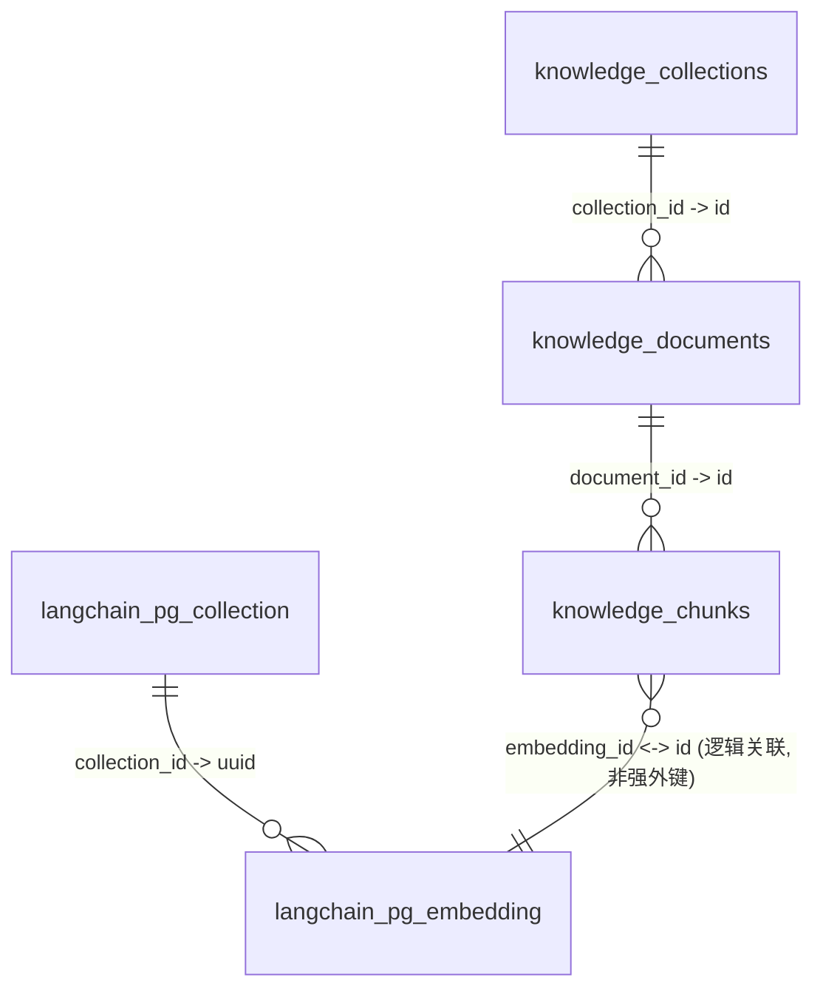

# 知识库与向量表关系说明

本文说明为什么数据库中会同时出现 `knowledge_collections` 与 `langchain_pg_collection`，以及它们与文档、分块、向量数据之间的关系。

## 一、为什么会有两个“集合表”

这是设计上的分层，不是重复建表：

- `knowledge_collections`：业务层集合表（Prisma 管理）
  - 给管理后台和业务接口使用
  - 存业务字段：`id`、`name`、`description`、`metadata`、`created_at`、`updated_at`
- `langchain_pg_collection`：向量层集合表（LangChain PGVector 使用）
  - 给向量库内部关联使用
  - 主要被 `langchain_pg_embedding.collection_id` 引用
  - 主键为 `uuid`

因此，同一个集合名（如 `travel-knowledge-base`）出现在两张表中是正常现象。

## 二、核心表关系图



## 三、各表职责

### 1) `knowledge_collections`

- 业务知识库集合
- 用于后台“集合管理”
- 与 `knowledge_documents` 一对多

### 2) `knowledge_documents`

- 原始知识文档（标题、正文、分类、标签、状态）
- `collection_id` 指向业务集合
- 与 `knowledge_chunks` 一对多

### 3) `knowledge_chunks`

- 文档切块后的记录
- `document_id` 指向原始文档
- `embedding_id` 记录向量库行 ID（逻辑关联）

### 4) `langchain_pg_collection`

- PGVector 向量集合定义
- 与 `langchain_pg_embedding` 一对多

### 5) `langchain_pg_embedding`

- 向量数据本体（embedding、document、cmetadata）
- 检索时主要在该表执行相似度查询

## 四、推荐排查链路

按这条链路从业务层追到向量层：

`knowledge_collections` -> `knowledge_documents` -> `knowledge_chunks.embedding_id` -> `langchain_pg_embedding.id`

## 五、常用排查 SQL

> 以下 SQL 以 PostgreSQL 为例。

### 1) 查看同名集合是否在两层都存在

```sql
SELECT id, name, created_at, updated_at
FROM knowledge_collections
WHERE name = 'travel-knowledge-base';

SELECT uuid, name, cmetadata
FROM langchain_pg_collection
WHERE name = 'travel-knowledge-base';
```

### 2) 查看某业务集合下文档与分块数量

```sql
SELECT
  kc.name AS collection_name,
  COUNT(DISTINCT kd.id) AS doc_count,
  COUNT(kch.id) AS chunk_count
FROM knowledge_collections kc
LEFT JOIN knowledge_documents kd ON kd.collection_id = kc.id
LEFT JOIN knowledge_chunks kch ON kch.document_id = kd.id
WHERE kc.name = 'travel-knowledge-base'
GROUP BY kc.name;
```

### 3) 检查分块是否已成功回填 embedding_id

```sql
SELECT
  COUNT(*) AS total_chunks,
  COUNT(*) FILTER (WHERE embedding_id IS NOT NULL) AS embedded_chunks,
  COUNT(*) FILTER (WHERE embedding_id IS NULL) AS missing_embedding_chunks
FROM knowledge_chunks;
```

### 4) 抽样校验 chunk 与向量行是否对应

```sql
SELECT
  kch.id AS chunk_id,
  kch.embedding_id,
  lpe.id AS embedding_row_id
FROM knowledge_chunks kch
LEFT JOIN langchain_pg_embedding lpe
  ON lpe.id = kch.embedding_id
ORDER BY kch.created_at DESC
LIMIT 20;
```

## 六、注意事项

- 不建议删除 `knowledge_collections` 或 `langchain_pg_collection` 中任意一张表。
- 这两张表面向不同层，缺一会导致业务层或向量层功能异常。
- 若需要“删除一个集合”，应通过应用层流程同步清理业务数据与向量数据，避免孤儿记录。

